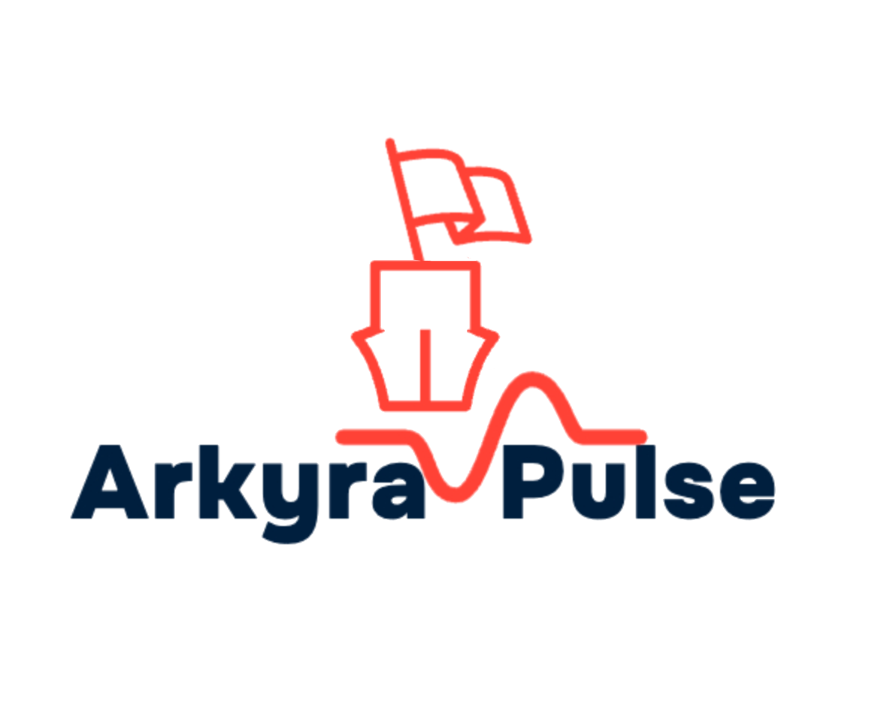

<p align="center">
  <a href="https://arkyra.pro/" target="_blank">
  <picture>
    <source media="(prefers-color-scheme: dark)" srcset="./apps/frontend/public/logos/arkyra-pulse-light.png">
    
  </picture>
  </a>
</p>

<p align="center">
<a href="https://opensource.org/license/agpl-v3">
  
</a>
</p>

<div align="center">
  <strong>
  <h2>Enterprise Social Media Management Platform</h2><br />
  <a href="https://arkyra.pro">ARKYRA</a>: Built for Al Jazeera, ready for the world.<br /><br />
  </strong>
  ARKYRA offers everything you need to manage your social media posts,<br />build an audience, capture leads, and grow your business.<br />
  Powered by AI, designed for scale, built for enterprise.
</div>

<div class="flex" align="center">
  <br />
  
  
  
  
  
  
  
  
  
  
  
  
  
  
</div>

<p align="center">
  <br />
  <a href="https://github.com/MOHJRNL/ARKYRA" rel="dofollow"><strong>Explore the Repository »</strong></a>
  <br />

  <br />
  <a href="./DEPLOYMENT_GUIDE.md" rel="dofollow"><strong>Read the Deployment Guide »</strong></a>
  <br />
</p>

<p align="center">
  <a href="https://arkyra.pro">Visit Website</a>
  ·
  <a href="https://github.com/MOHJRNL/ARKYRA/issues">Report Issues</a>
  ·
  <a href="./CLOUDFLARE_DNS_SETUP.md">DNS Setup Guide</a><br />
</p>

<br />

## 🚀 About ARKYRA

ARKYRA is an enterprise-grade social media management platform built on the foundation of open-source excellence. Originally developed for Al Jazeera's internal operations, ARKYRA is designed to handle the demands of large-scale media organizations while remaining accessible and powerful for businesses of all sizes.

### Key Differentiators

- **Enterprise-Ready**: Built from day one with multi-tenancy, RBAC, and enterprise security in mind
- **Al Jazeera Branding**: Full visual identity customization with Al Jazeera colors, fonts, and RTL support
- **Multi-Language Support**: Native support for Arabic, English, French, Spanish, and German
- **AI-Powered**: Integrated with Google Gemini for intelligent content generation and optimization
- **Self-Hosted**: Complete control over your data and infrastructure
- **SaaS-Ready**: Architecture designed for both internal deployment and SaaS offerings

## ✨ Features

### Core Capabilities

- **Multi-Platform Scheduling**: Schedule posts across 14+ social media platforms
- **Flexible AI Integration**: Support for 5+ AI providers (OpenAI, Anthropic, Google Gemini, Groq, Mistral)
- **AI Content Generation**: Intelligent content creation, image generation, and optimization
- **Analytics & Insights**: Comprehensive analytics to measure your social media performance
- **Team Collaboration**: Invite team members, assign roles, and collaborate on content
- **RTL Support**: Full right-to-left layout support for Arabic and other RTL languages
- **Dark Mode**: Beautiful dark theme that respects user preferences
- **API-First Design**: Complete REST API for automation and integrations

### Enterprise Features

- **Multi-Tenancy**: Support for multiple organizations with data isolation
- **RBAC (Role-Based Access Control)**: Granular permissions and access control
- **SSO Integration**: Single sign-on support for enterprise authentication
- **Audit Logging**: Comprehensive audit trails for compliance
- **Rate Limiting**: Intelligent API rate limiting to prevent platform bans
- **Load Distribution**: Proxy support for managing 190+ social accounts

## 🏗️ Architecture

ARKYRA is built on a modern, scalable architecture:

### Tech Stack

- **Frontend**: Next.js 14, React 18, TypeScript, Tailwind CSS
- **Backend**: NestJS, Node.js 22
- **Database**: PostgreSQL 16 with Prisma ORM
- **Cache & Queue**: Redis 7
- **Workflow Engine**: Temporal for reliable task orchestration
- **Containerization**: Docker & Docker Compose
- **Reverse Proxy**: Nginx
- **AI Integration**: Google Gemini API

### Monorepo Structure

```
arkyra/
├── apps/
│   ├── frontend/          # Next.js frontend application
│   ├── backend/           # NestJS backend API
│   └── orchestrator/      # Temporal workflow workers
├── libraries/
│   ├── nestjs-libraries/  # Shared backend libraries
│   ├── react-shared-libraries/  # Shared frontend libraries
│   └── helpers/           # Common utilities
└── docker/                # Docker configuration files
```

## 🚀 Quick Start

### Prerequisites

- Docker 20.10+ and Docker Compose 2.0+
- Node.js 22.12.0+ (for local development)
- pnpm 10.6.1+

### One-Command Deployment

```bash
# Clone the repository
git clone https://github.com/MOHJRNL/ARKYRA.git
cd ARKYRA

# Copy environment variables
cp .env.arkyra.example .env

# Edit .env with your configuration
nano .env

# Start all services
./start-arkyra.sh
```

The platform will be available at:
- **ARKYRA Platform**: http://localhost:4007
- **Temporal UI**: http://localhost:8080

For detailed deployment instructions, see the [Deployment Guide](./DEPLOYMENT_GUIDE.md).

## 🌐 Domain Configuration

To deploy ARKYRA on your domain (arkyra.pro), follow the comprehensive [Cloudflare DNS Setup Guide](./CLOUDFLARE_DNS_SETUP.md).

## 📚 Documentation

- **[AI Models Guide](./AI_MODELS_GUIDE.md)**: Complete guide to AI providers and models
- **[Deployment Guide](./DEPLOYMENT_GUIDE.md)**: Complete deployment instructions
- **[Cloudflare DNS Setup](./CLOUDFLARE_DNS_SETUP.md)**: Domain configuration guide
- **[Project README](./ARKYRA_PROJECT_README.md)**: Project overview and architecture
- **[AI Dependencies](./AI_DEPENDENCIES.md)**: NPM packages for AI providers
- **[Implementation Roadmap](./arkyra_research/05_implementation_roadmap.md)**: Phased development plan

## 🎨 Branding & Customization

ARKYRA supports two branding modes:

1. **AJ ARKYRA**: Internal platform for Al Jazeera with Al Jazeera logo and branding
2. **ARKYRA SaaS**: Public platform with ARKYRA Pulse branding

Switch between modes using the `NEXT_PUBLIC_BRAND_TYPE` environment variable:

```env
# For Al Jazeera internal use
NEXT_PUBLIC_BRAND_TYPE=aj-arkyra

# For SaaS deployment
NEXT_PUBLIC_BRAND_TYPE=arkyra-saas
```

## 🌍 Multi-Language Support

ARKYRA supports 5 languages out of the box:

- **Arabic (العربية)** - RTL support included
- **English**
- **French (Français)**
- **Spanish (Español)**
- **German (Deutsch)**

Set the default language in your `.env` file:

```env
NEXT_PUBLIC_DEFAULT_LANGUAGE=ar  # or en, fr, es, de
```

## 🔐 Security & Compliance

ARKYRA is built with enterprise security in mind:

- **Data Isolation**: Multi-tenant architecture with complete data separation
- **OAuth 2.0**: Secure authentication with social platforms
- **SSO Support**: OIDC/SAML integration for enterprise authentication
- **Audit Logging**: Comprehensive audit trails for compliance
- **WAF Ready**: Web Application Firewall integration support
- **Rate Limiting**: Intelligent API rate limiting to prevent abuse

## 🤝 Contributing

We welcome contributions! Please see our [Contributing Guide](./CONTRIBUTING.md) for details.

## 📝 License

This repository's source code is available under the [AGPL-3.0 license](LICENSE).

## 🙏 Acknowledgments

ARKYRA is built on the foundation of [Postiz](https://github.com/gitroomhq/postiz-app), an excellent open-source social media scheduling tool. We extend our gratitude to the Postiz team for their pioneering work in this space.

## 📧 Support

For support and questions:
- Create an issue on [GitHub Issues](https://github.com/MOHJRNL/ARKYRA/issues)
- Check the [Deployment Guide](./DEPLOYMENT_GUIDE.md) for troubleshooting

---

<p align="center">
  Built with ❤️ for Al Jazeera and the world
</p>
